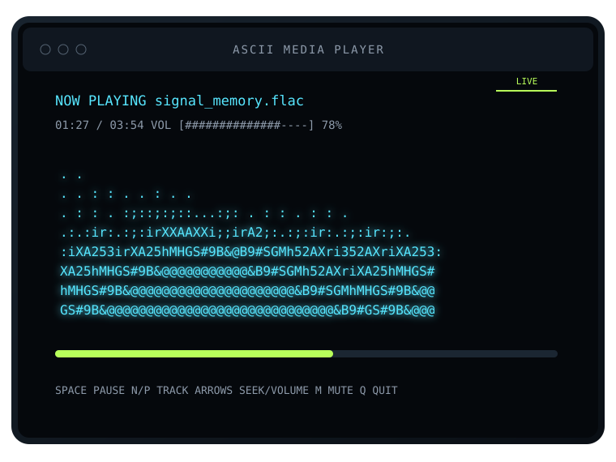

<p align="center">
  <a href="https://5ivesaw.github.io/Ascii-Media-Player/">
    
  </a>
</p>

<h1 align="center">ASCII Media Player</h1>

<p align="center">
  Local audio playback with a real-time ASCII spectrum, packaged for Windows, Linux, Android, macOS, and the web.
</p>

<p align="center">
  <a href="https://5ivesaw.github.io/Ascii-Media-Player/">Launch web player</a>
  ·
  <a href="https://github.com/5ivesaw/Ascii-Media-Player/releases/latest">Download latest release</a>
  ·
  <a href="#release-system">Release system</a>
  ·
  <a href="#publishing-from-termux">Publish from Termux</a>
</p>

<p align="center">
  
</p>

## Overview

ASCII Media Player is a local-first music player with two engines:

- A Python terminal application for recursive folder playback, keyboard controls, cached FFmpeg conversion, and optional `yt-dlp` downloads.
- A browser player that analyzes local files through the Web Audio API and renders a spectrum or waveform as text.

The browser edition never uploads selected audio. The Android APK bundles that browser player inside a native WebView shell, including Android file selection and fullscreen handling.

## Version 2.2

Version 2.2 turns the project into a complete release product rather than a source-only repository.

- Windows x64 standalone EXE and ZIP package.
- Linux x64 portable binary and tar package.
- Linux ARM64 portable binary and tar package.
- Android APK containing the offline web player.
- macOS Intel native package.
- macOS Apple Silicon native package.
- Source archive and SHA-256 checksum file.
- One GitHub Release generated automatically for every version tag.
- Website buttons that resolve the newest release and recommend the correct platform.
- Stable Android release signing configured from Termux through GitHub repository secrets.
- Direct Linux, macOS, and Windows installer scripts.

## Download matrix

| Platform | Release asset | Architecture | Notes |
|---|---|---|---|
| Windows | `.exe` and `.zip` | x64 | Python is bundled |
| Linux | binary and `.tar.gz` | x64 | Includes local installer |
| Linux | binary and `.tar.gz` | ARM64 | Includes local installer |
| Android | `.apk` | Universal | Bundled offline web player |
| macOS | `.zip` | Apple Silicon | Native ARM64 build |
| macOS | `.zip` | Intel | Native x64 build |
| Web | GitHub Pages / PWA | Browser | Installable where supported |

Latest release: https://github.com/5ivesaw/Ascii-Media-Player/releases/latest

## Quick installation

### Windows

Download the latest `Windows-x64.exe` asset and run it from Windows Terminal:

```powershell
.\ASCII-Media-Player-v2.2.0-Windows-x64.exe "C:\Music"
```

PowerShell installer:

```powershell
irm https://raw.githubusercontent.com/5ivesaw/Ascii-Media-Player/main/scripts/install-windows.ps1 | iex
```

### Linux

Online user-level installer:

```bash
curl -fsSL https://raw.githubusercontent.com/5ivesaw/Ascii-Media-Player/main/scripts/install-linux.sh | sh
```

Then run:

```bash
ascii-media-player ~/Music
```

The release also contains direct x64 and ARM64 binaries and tar archives.

### Android

Download the latest `Android.apk` release asset, allow installation from the browser or file manager when Android asks, and install it. The app works offline after installation because its web interface is packaged inside the APK.

### macOS

Installer for the matching Mac architecture:

```bash
curl -fsSL https://raw.githubusercontent.com/5ivesaw/Ascii-Media-Player/main/scripts/install-macos.sh | sh
```

Then run:

```bash
ascii-media-player ~/Music
```

The macOS build is not Apple-notarized. The ZIP contains instructions for removing the download quarantine attribute if Gatekeeper blocks it.

### Web

Open the hosted player:

https://5ivesaw.github.io/Ascii-Media-Player/

The site supports multiple local files, drag-and-drop, queue controls, spectrum and waveform modes, repeat, shuffle, seeking, volume, fullscreen, four themes, and an offline application shell.

## Run from source

Requirements:

- Python 3.10 or newer
- FFmpeg only for FLAC, AAC, M4A, WebM, Opus, and WMA conversion
- An ANSI-capable terminal

```bash
git clone https://github.com/5ivesaw/Ascii-Media-Player.git
cd Ascii-Media-Player
python -m pip install -r requirements.txt
python app.py "/path/to/music"
```

Interactive folder selection:

```bash
python app.py
```

Pre-convert supported compressed files into the reusable cache:

```bash
python app.py --convert-only "/path/to/music"
```

## Terminal controls

| Key | Action |
|---|---|
| `Space` | Play or pause |
| `N` | Next track |
| `P` | Previous track |
| `Left` / `Right` | Seek backward or forward five seconds |
| `Up` / `Down` | Raise or lower volume |
| `M` | Toggle mute |
| `/` | Search the local library |
| `Y` | Download through `yt-dlp` |
| `Q` | Quit |

## Release system

`.github/workflows/release.yml` runs when a tag such as `v2.2.0` is pushed. Each desktop build runs on its actual target operating system because PyInstaller is not a cross-compiler.

The workflow performs these jobs:

1. Validate the tag against `APP_VERSION` and validate the full project.
2. Build Windows x64 with PyInstaller on a Windows runner.
3. Build Linux x64 and ARM64 on separate Linux runners.
4. Build macOS Intel and Apple Silicon on separate Mac runners.
5. Build the Android APK with Android Gradle Plugin 9.3, Gradle 9.5, JDK 17, and Android API 36.
6. Download all workflow artifacts into one release job.
7. Add installer scripts and a source ZIP.
8. Generate `SHA256SUMS.txt`.
9. Create or update the matching GitHub Release.

The release can also be rebuilt manually from Actions by selecting the existing tag in the workflow input.

## Android signing

`scripts/publish-termux.sh` creates a long-lived Android release key on the phone the first time it runs. It stores the key and passwords as encrypted GitHub repository secrets:

- `ANDROID_KEYSTORE_BASE64`
- `ANDROID_STORE_PASSWORD`
- `ANDROID_KEY_PASSWORD`
- `ANDROID_KEY_ALIAS`

The local backup is stored under:

```text
~/.config/ascii-media-player/signing
```

The GitHub secrets allow future versions to keep the same Android application signature. If the secrets are absent, the workflow falls back to a debug signing key; that APK remains installable but is not suitable as a stable update channel.

## Publishing from Termux

The upgrade publisher performs the full operation from Android:

1. Clones the current `main` branch.
2. Replaces it with the packaged upgrade.
3. Detects the repository and calculates its GitHub Pages URL.
4. Rewrites website and repository links.
5. Validates Python, JavaScript, JSON, XML, SVG, PNG, Android, packaging, and workflow files.
6. Creates and uploads stable Android signing secrets when needed.
7. Commits and pushes `main`.
8. Enables GitHub Pages and updates the repository Website field.
9. Pushes the version tag.
10. Waits for the cross-platform release workflow.

From the extracted upgrade package:

```bash
bash scripts/publish-termux.sh
```

To publish the current source as another semantic version:

```bash
bash scripts/release-termux.sh 2.2.1
```

## Version management

Read the current version:

```bash
python scripts/set-version.py --print
```

Update every managed version field:

```bash
python scripts/set-version.py 2.2.1
```

This updates the Python application, website metadata, Android version name, and Android version code.

## Project structure

```text
.
├── app.py
├── requirements.txt
├── android/
│   ├── build.gradle
│   ├── settings.gradle
│   └── app/
│       ├── build.gradle
│       └── src/main/
├── packaging/
│   ├── README-WINDOWS.txt
│   ├── README-LINUX.txt
│   ├── README-MACOS.txt
│   └── platform launchers
├── scripts/
│   ├── build-desktop.py
│   ├── configure-site.sh
│   ├── install-linux.sh
│   ├── install-macos.sh
│   ├── install-windows.ps1
│   ├── publish-termux.sh
│   ├── release-termux.sh
│   ├── set-version.py
│   └── validate-project.py
├── .github/workflows/
│   ├── pages.yml
│   ├── release.yml
│   └── validate.yml
└── docs/
    ├── index.html
    ├── styles.css
    ├── player.js
    ├── site-config.js
    ├── sw.js
    ├── manifest.webmanifest
    └── assets/
```

## Privacy

Selected web and Android audio files are opened locally. The project has no upload endpoint, user account, analytics SDK, advertising code, tracking pixel, or remote media database.

The optional terminal `yt-dlp` command makes network requests only after the user explicitly invokes it.

## Development checks

```bash
python -m py_compile app.py
python scripts/validate-project.py
python scripts/set-version.py --print
node --check docs/player.js
node --check docs/sw.js
```

## License

Released under the MIT License. See [LICENSE](LICENSE).

[repository]: https://github.com/5ivesaw/Ascii-Media-Player
[site]: https://5ivesaw.github.io/Ascii-Media-Player/
